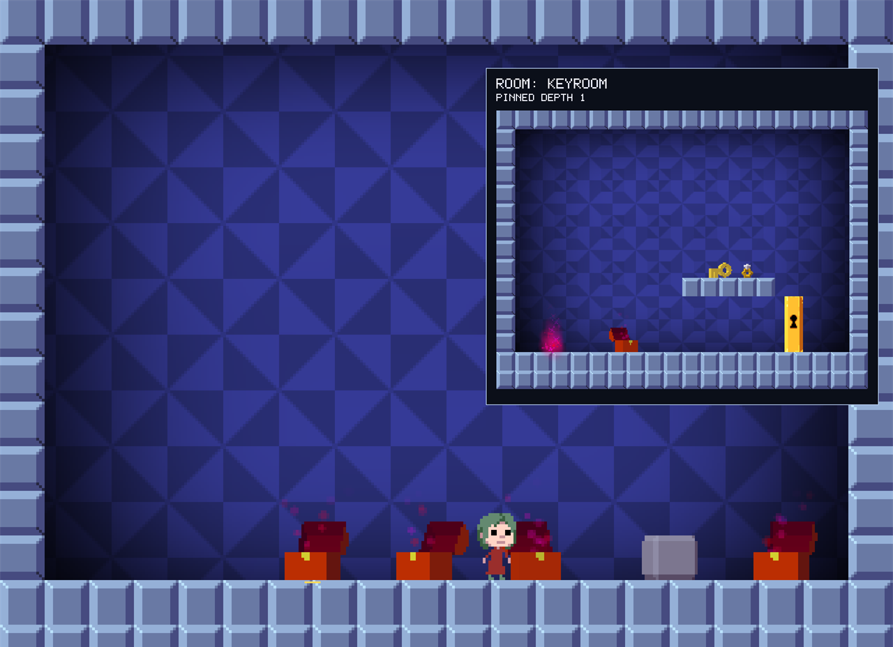

# Recursed++

A Windows x86 mod that lets you inspect rooms inside chests and look back through return portals, inspired by the visible nesting in Patrick's Parabox. Hover to preview, click to pin, or open a separate window and explore up to eight levels deep. A move you regret can be undone.

The preview now uses Recursed's original renderer for terrain, depth-dependent backgrounds, lighting, models, chest particles, key rotation, and water effects. Room state remains approximate; rendering fidelity and entry-state simulation are separate concerns.



## Download and play

1. Open this repository's **Releases** page and take the newest one.
2. Download **Recursed-Plus-Plus.exe**. `SHA256SUMS.txt` beside it is there to check the download against, if you want to.
3. Run it.

Builds between releases are on the **Actions** tab, under a successful **Build Windows patch** run: the `Recursed-Plus-Plus` artifact holds the same executable, and GitHub wraps it in a zip of its own.

It looks for your Steam copy of Recursed on its own; if you keep the game somewhere it cannot find, or you have no Steam, choose `Recursed.exe` yourself. It refuses anything that is not the executable fingerprint below, because the mod reads addresses measured against that one build. The controls are printed in the launcher window, so nothing extra is drawn over the game.

That executable is the whole download: it carries the mod inside itself and unpacks it under `%LOCALAPPDATA%\Recursed++` when you press Play. It contains no game executable, game assets, or save files.

**What it does to your installation.** Nothing is written into the game's folder. You play the progress you already have, through Steam, with achievements and cloud saves as they always were; only the graphics and sound settings are kept apart, under `%LOCALAPPDATA%\Recursed++\profile`. The mod is loaded into a game process the launcher starts; it never attaches to a game you started yourself, and starting Recursed through Steam does not load it.

Security software often blocks the mod, because loading code into another process is what a cheat would do. The launcher says so when that happens, and names the files to allow. `%LOCALAPPDATA%\Recursed++\peek.log` records what the mod did.

## Your progress

By default the mod plays through Steam like the game always has: the achievements, statistics and cloud saves are your own. Nothing about where progress lives changes, and the launcher's **Play** page has nothing to decide.

Recursed stores progress through Steam Cloud and nowhere else, and skips the write entirely when Steam did not answer, which is why a run without Steam used to start over every time. When Steam is not running, the mod gives the game storage of its own instead, under `%LOCALAPPDATA%\Recursed++\saves`. Those are the files Steam keeps in `userdata\<account>\497780\remote`, in the same format, so a save can be carried either way by copying it.

The launcher's **Advanced** page holds the rest, for the times you want the mod kept away from your own progress:

- **Play isolated** keeps the game away from Steam entirely. Progress lives in that save folder alone, achievements are not unlocked, and what you normally play is never written to.
- **Import from Steam** copies what you have already done in Steam into that folder, which is what an isolated run starts from. Close the game first: a running game writes its whole progress back the next time it saves. Whatever the import replaces is kept beside it in a dated `replaced-...` folder, and your Steam copy is only read, never written.
- **Save folder** opens where all of this is kept.

## Controls

| Input | Action |
| --- | --- |
| Hover over a chest or return flame | Preview the room it leads to |
| Left click | Pin the preview in the game window |
| Shift + left click | Open a separate preview window |
| O | Move the preview between the game and a separate window |
| Hover a chest or flame inside a preview pinned in the game window | Show the depth and room a click there opens |
| Click a chest inside the pinned preview | Explore another level, up to depth 8 |
| Click a red or green return flame | Look outside the room |
| Mouse back and forward buttons | Walk the preview history in either direction |
| Backspace | Go back in preview history; close at the root |
| Right click | Close a pinned preview |
| Esc | Close the preview without pausing the game |
| Q, or RB on a gamepad | Undo: go back to just before your last action |
| W, or RT on a gamepad | Go back five seconds of game time |

Inspection is always on, and nothing is drawn over the game until you hover something, apart from a short note when an undo has nothing to go back to or could not land exactly: the controls are in the launcher window rather than on screen. The system pointer stays visible, including when moving between the game and the preview window, because it is what you aim with.

The separate window supports resizing and maximization, preserves a 4:3 image, and displays depth and room name in its title. The separate window accepts shortcuts directly, without IME composition. If an input method intercepts letter keys in the main game, switch to an English layout, or hold Ctrl with O, Q or W. Chests have a small hover underline instead of persistent bounding boxes.

Depth is relative to the room you are playing: `1` is inside, `0` is the current room, and `-1` is outside. There is currently one shared preview, shown either inline or in one separate window.

## Undo

Q, or RB on a gamepad, takes back your last action: a jump, picking something up or throwing it, or setting off from standing still. Press it again to go back one more. Turning round while you are already moving is part of the same action, and a key you are still holding when you undo does not count as a new one. Rooms you jumped into or walked out of are undone along with the action. W, or RT, goes back five seconds of game time instead. They work in the game window and in the separate preview window, but not from the pause menu, and say so when there is nothing to go back to. None of the four is one of the game's own controls unless you make it one; if you do, in the game's control settings, it stays that control and does not undo.

Undo reaches back to the start of the level, or to the last time you chose Restart yourself; leaving the level forgets it. The game cannot store a moment and return to it, so an undo restarts the level and replays everything you did up to the chosen moment, all in one frame. That takes longer the longer you have been in the level: about 30 ms for three minutes of busy play. The replay is silent, and every sound still playing when you undo stops, including a voice line you return to the middle of. Nothing you already unlocked or counted in Steam is counted again. Like any room change, an undo closes an open preview.

## What is rendered

Supported scenes create a private native Room, entities, and Renderer. The original rendering pipeline draws to a separate framebuffer at up to 30 Hz. Supported objects are chests, keys, locks, boxes, records, fans, cauldrons, jars, generics, birds, crystal/diamond/ruby collectibles, and red/green return portals. Terrain and water surfaces use native tile definitions, not guessed sprite-frame indices.

Fresh destination objects use the original collision-aware spawn placement, including its twenty downward steps of 0.05 tiles for eligible bodies. This fixes objects hovering just above the floor. Ongoing gravity and buoyancy are not fast-forwarded; visual effects animate after placement. Existing outer-room objects retain their captured positions. No gameplay player is constructed in the preview.

Two objects are still handled differently. A room holding a crux uses the resource-based fallback renderer, because attaching one starts a looping sound and a preview stays silent. A bird is built into the scene, but the game creates its sprite inside the gameplay update a preview never runs, so the bird itself is not drawn; the fallback renderer does not draw birds either. Normal UI shows navigation and actionable errors, without implementation labels or manual water controls.

The first level reads the actual chest's wet flag. Deeper levels infer wetness from snapshot tiles. Saved global objects replace initial declarations, and self-referencing previews read the current room's global objects. Held or destroyed objects are excluded where identified. Unvisited rooms retain their initial declarations.

An open preview resamples relevant game state on the render thread and redraws at up to 30 Hz. Outside previews read the real room stack, tiles, and entities, so moved or removed objects are reflected. Inside previews refresh saved globals and the source chest's liquid state. A changed root destination or liquid branch resets deeper navigation. Live/global chests along a nested path are also revalidated: water changes update the branch and a removed chest returns to its parent. A missing root source or room transition closes the preview. The main game continues running while you inspect.

Ordinary chest entry constructs a fresh room, so local objects inside a hypothetical destination still come from its room script. Outer previews use existing room instances. Carried-item branches, consecutive hypothetical entries, preserved jar instances, and cauldron rules are not fully modeled. Outer objects are reconstructed for display, so orientation and particle phase need not match the original instance exactly. See the [validation notes](docs/validation.md) for tested behavior and remaining GUI checks.

## Compatibility

Supported `Recursed.exe` SHA-256:

```text
0E47D5DF0F45152978777E5F8EC7F2435BAB79CD84D630CFAAD5106B90D74251
```

The launcher validates the executable, and the DLL checks instruction signatures and vtables. Other builds are rejected. The original installation is not modified.

Your progress is your own Steam progress, and the mod only adds to it what the game itself would. An isolated run keeps its own copy under `%LOCALAPPDATA%\Recursed++\saves`, and an import there keeps what it replaced.

## Implementation

- `src/plugin.cpp`: SFML display/input hooks, chest detection, preview navigation, and the in-game overlay.
- `src/snapshot.cpp`: bounded Lua VM capturing room declarations and wet branches.
- `src/runtime_state.cpp`: read-only room-stack and global-object extraction for the supported build.
- `src/native_scene.cpp`: isolated native scene ownership, tile mapping, and original entity construction.
- `src/native_render.cpp`: original renderer hook, private framebuffer, animation clock, and gameplay-field audit.
- `src/room_art.cpp`, `src/asset_mesh.cpp`, `src/particle_sim.cpp`: resource-based fallback.
- `src/preview_window.cpp`: the separate Win32 preview window.
- `src/save_store.cpp`: the file-backed stand-in for Steam Cloud storage, and the Steam import.
- `src/rewind.cpp`, `src/play_record.cpp`: undo, by recording each tick's controls and replaying them after the game's own Restart.

The native path borrows read-only level metadata while owning its room stack, scene entities, and rendering resources. It isolates random-number use and room numbering. The normal game draw runs last. A failed gameplay-field audit disables native previews for that process; this bounded audit is not a proof that every engine field is unchanged.

Logs are written to `%LOCALAPPDATA%\Recursed++\peek.log`. Building, testing and the authored test levels are described in [CONTRIBUTING.md](CONTRIBUTING.md).

See the [changelog](CHANGELOG.md), [design](DESIGN.md), [reverse-engineering notes](FEASIBILITY.md), and [third-party notices](THIRD_PARTY_NOTICES.md), which the launcher also shows on its Notices page. This is an unofficial mod and is not affiliated with Recursed's developers.
