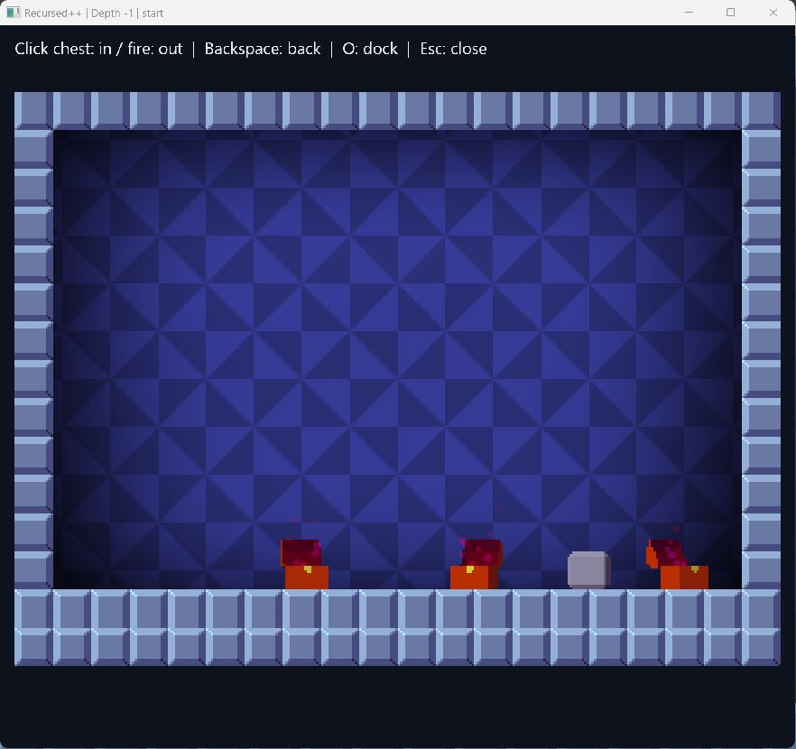

# Recursed++

A Windows x86 mod that lets you inspect rooms inside chests and look back through return portals, inspired by the visible nesting in Patrick's Parabox. Hover to preview, click to pin, or open a separate window and explore up to eight levels deep.

The preview now uses Recursed's original renderer for terrain, depth-dependent backgrounds, lighting, models, chest particles, key rotation, and water effects. Room state remains approximate; rendering fidelity and entry-state simulation are separate concerns.



## Download and play

1. Open this repository's **Actions** tab and select a successful **Build Windows patch** run.
2. Download the `Recursed-Plus-Plus-windows-x86` artifact and extract the archive inside it into one folder.
3. Run **Recursed-Plus-Plus.exe**.

It looks for your Steam copy of Recursed on its own; if you keep the game somewhere it cannot find, or you have no Steam, choose `Recursed.exe` yourself. It refuses anything that is not the executable fingerprint below, because the mod reads addresses measured against that one build. The controls are printed in the launcher window, so nothing extra is drawn over the game.

The archive contains the mod, its launcher, the developer scripts, and the authored test levels. It contains no game executable, game assets, or save files.

**What it does to your installation.** Nothing is written into the game's folder, and your normal saves are not touched: the modded process never reaches Steam, keeps its progress in `%LOCALAPPDATA%\Recursed++\saves`, and has its configuration redirected to `%LOCALAPPDATA%\Recursed++\profile`. The one thing it shares with the unmodded game is `recursed.conf`, the graphics and sound settings the game writes next to itself. The mod is loaded into a game process the launcher starts; it never attaches to a game you started yourself, and starting Recursed through Steam does not load it.

Security software often blocks the mod, because loading code into another process is what a cheat would do. The launcher says so when that happens, and names the files to allow. `%LOCALAPPDATA%\Recursed++\peek.log` records what the mod did.

## Your progress

The modded run keeps its own progress, separate from the copy you normally play, under `%LOCALAPPDATA%\Recursed++\saves`. **Save folder** in the launcher opens it. It carries over between runs.

Recursed stores progress through Steam Cloud and nowhere else, and skips the write entirely when Steam is missing, which is why an isolated run used to start over every time. This build hands the game a private stand-in for that storage instead, writing the same files to that folder. They are the files Steam keeps in `userdata\<account>\497780\remote`, in the same format, so a save can be carried either way by copying it.

**Import from Steam** copies what you have already done in your Steam copy into this build. Close the game first: a running game writes its whole progress back the next time it saves. The progress an import replaces is kept beside it in a dated `replaced-...` folder, and your Steam copy is only read, never written.

## Preview Lab and the other test levels

The mod's own test rooms replace the game's level menu, so they need a separate copy of the game rather than your installed one. In PowerShell, from the extracted folder:

```powershell
./tools/backup-saves.ps1
./tools/prepare-runtime.ps1
```

For a non-default installation, pass `-SteamDirectory 'D:\Steam'` to the backup script and `-GameDirectory 'D:\SteamLibrary\steamapps\common\Recursed'` to the preparation script. Then run **Start-Preview.cmd** and press Enter twice to open **Preview Lab**.

## Controls

| Input | Action |
| --- | --- |
| Hover over a chest or return flame | Preview the room it leads to |
| Left click | Pin the preview in the game window |
| Shift + left click | Open a separate preview window |
| O | Move the preview between the game and a separate window |
| Click a chest inside the pinned preview | Explore another level, up to depth 8 |
| Click a red or green return flame | Look outside the room |
| Backspace | Go back in preview history; close at the root |
| Esc | Close the preview without pausing the game |
| F8 | Toggle inspection |
| F7 | Developer diagnostic: redraw the active room, not a chest destination |

The system pointer stays visible while inspection is enabled, including when moving between the game and the preview window. F8 restores the game's requested cursor visibility when inspection is disabled.

The separate window supports resizing and maximization, preserves a 4:3 image, and displays depth and room name in its title. The separate window accepts shortcuts directly, without IME composition. If an input method intercepts letter keys in the main game, switch to an English layout or use Ctrl + O. Chests have a small hover underline instead of persistent bounding boxes.

Depth is relative to the room you are playing: `1` is inside, `0` is the current room, and `-1` is outside. There is currently one shared preview, shown either inline or in one separate window.

The test menu includes **Preview Lab** (including a room with both return flames), stock **Chests** and **Flood**, **State Lab** for wet/global state, and **Render Lab** for comparing the native room and its self-referencing preview.

## What is rendered

Supported scenes create a private native Room, entities, and Renderer. The original rendering pipeline draws to a separate framebuffer at up to 30 Hz. Supported objects are chests, keys, locks, boxes, records, fans, cauldrons, jars, generics, birds, crystal/diamond/ruby collectibles, and red/green return portals. Terrain and water surfaces use native tile definitions, not guessed sprite-frame indices.

Fresh destination objects use the original collision-aware spawn placement, including its twenty downward steps of 0.05 tiles for eligible bodies. This fixes objects hovering just above the floor. Ongoing gravity and buoyancy are not fast-forwarded; visual effects animate after placement. Existing outer-room objects retain their captured positions. No gameplay player is constructed in the preview.

Two objects are still handled differently. A room holding a crux uses the resource-based fallback renderer, because attaching one starts a looping sound and a preview stays silent. A bird is built into the scene, but the game creates its sprite inside the gameplay update a preview never runs, so the bird itself is not drawn; the fallback renderer does not draw birds either. Normal UI shows navigation and actionable errors, without implementation labels or manual water controls.

The first level reads the actual chest's wet flag. Deeper levels infer wetness from snapshot tiles. Saved global objects replace initial declarations, and self-referencing previews read the current room's global objects. Held or destroyed objects are excluded where identified. Unvisited rooms retain their initial declarations.

An open preview resamples relevant game state on the render thread and redraws at up to 30 Hz. Outside previews read the real room stack, tiles, and entities, so moved or removed objects are reflected. Inside previews refresh saved globals and the source chest's liquid state. A changed root destination or liquid branch resets deeper navigation. Live/global chests along a nested path are also revalidated: water changes update the branch and a removed chest returns to its parent. A missing root source or room transition closes the preview. The main game continues running while you inspect.

Ordinary chest entry constructs a fresh room, so local objects inside a hypothetical destination still come from its room script. Outer previews use existing room instances. Carried-item branches, consecutive hypothetical entries, preserved jar instances, and cauldron rules are not fully modeled. Outer objects are reconstructed for display, so orientation and particle phase need not match the original instance exactly. See the [validation notes](docs/validation.md) for tested behavior and remaining GUI checks.

## Build from source

Requires Visual Studio 2022 C++ x86 tools and a Windows SDK. `build.cmd` locates the installation with `vswhere`, including Community, Enterprise, and Build Tools installations. Lua 5.2.4 is downloaded from its official source and checked against a fixed SHA-256.

```powershell
./tools/bootstrap.ps1
./build.cmd
./build/ci_test.exe
```

To run integration tests against your local game:

```powershell
./tools/backup-saves.ps1
./tools/prepare-runtime.ps1
./build/snapshot_test.exe
./build/render_test.exe
./tools/verify-backup.ps1
```

To create the same patch archive as CI:

```powershell
./tools/package.ps1
```

GitHub Actions builds on `windows-2022`, runs authored fixture tests without game files, and uploads the patch ZIP on pushes to `main`, version tags, pull requests, and manual dispatches. Game-dependent tests and native rendering validation must run locally. See [validation notes](docs/validation.md).

Use English in repository content and [Conventional Commits](https://www.conventionalcommits.org/en/v1.0.0/) for commit messages, such as `feat(preview): render isolated rooms with the native engine`.

## Compatibility and save backups

Supported `Recursed.exe` SHA-256:

```text
0E47D5DF0F45152978777E5F8EC7F2435BAB79CD84D630CFAAD5106B90D74251
```

The launcher validates the executable, and the DLL checks instruction signatures and vtables. Other builds are rejected. The original installation is not modified.

`tools/backup-saves.ps1` copies both your Steam progress and this build's own save folder. Backups live under `backups/<timestamp>/`, with source paths and SHA-256 values in `manifest.json`. The verification script checks both backups and original files. No restore script automatically overwrites progress. Exit the game and Steam before any manual restore. Runtime copies, backups, reverse-engineering dumps, dependencies, and build output are excluded from version control and patch packaging.

## Implementation

- `src/plugin.cpp`: SFML display/input hooks, chest detection, preview navigation, and the in-game overlay.
- `src/snapshot.cpp`: bounded Lua VM capturing room declarations and wet branches.
- `src/runtime_state.cpp`: read-only room-stack and global-object extraction for the supported build.
- `src/native_scene.cpp`: isolated native scene ownership, tile mapping, and original entity construction.
- `src/native_render.cpp`: original renderer hook, private framebuffer, animation clock, and gameplay-field audit.
- `src/room_art.cpp`, `src/asset_mesh.cpp`, `src/particle_sim.cpp`: resource-based fallback.
- `src/preview_window.cpp`: the separate Win32 preview window.
- `src/save_store.cpp`: the file-backed stand-in for Steam Cloud storage, and the Steam import.

The native path borrows read-only level metadata while owning its room stack, scene entities, and rendering resources. It isolates random-number use and room numbering. The normal game draw runs last. A failed gameplay-field audit disables native previews for that process; this bounded audit is not a proof that every engine field is unchanged.

Logs are written to `build/peek.log`. Automated local input tests may set `RECURSED_PEEK_TEST_INPUT=1` to buffer short SFML key events; the normal launcher script clears it.

See [design](DESIGN.md), [reverse-engineering notes](FEASIBILITY.md), and [third-party notices](THIRD_PARTY_NOTICES.md). This is an unofficial mod and is not affiliated with Recursed's developers.
